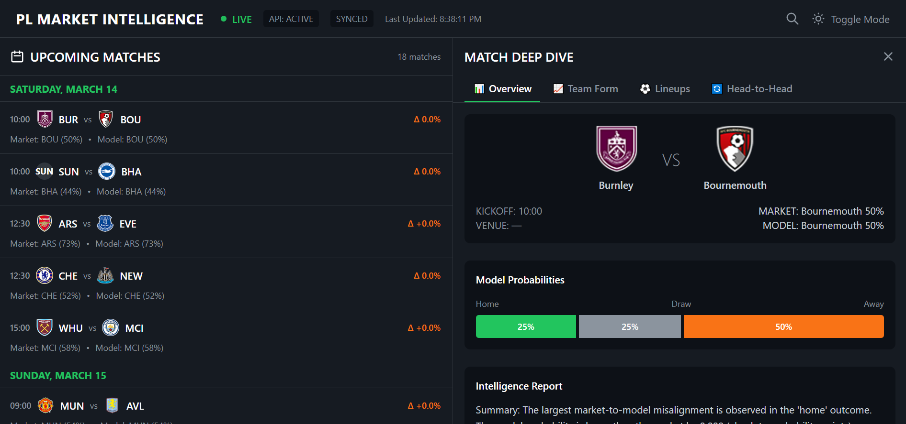

# Premier League Market Intelligence System

**AI-powered sports analytics platform that combines real-time betting odds, team news intelligence, and multi-agent reasoning to identify value opportunities in Premier League matches.**

---

## 🌟 Live Demo

**Experience the platform live:** [https://pl-analysis.vercel.app/](https://pl-analysis.vercel.app/)



---

## 🎯 What This Project Demonstrates

This is a **full-stack production application** showcasing advanced software engineering capabilities:

- **Multi-Agent AI Systems** using CrewAI for intelligent sports analysis
- **Real-time Data Integration** with external APIs and intelligent caching
- **Modern Web Architecture** with React + FastAPI + TypeScript
- **Production Deployment** on Vercel + Render with CI/CD automation
- **Performance Optimization** with stale-while-revalidate caching patterns
- **Professional UI/UX** with dark/light themes and responsive design

---

## 🎯 Tech Stack

**Backend:**
- Python 3.11+ | FastAPI | CrewAI | Pydantic
- Multi-agent AI orchestration with LangChain
- RESTful API with async request handling

**Frontend:**
- React 18 | TypeScript | TailwindCSS
- Real-time data visualization
- Responsive design with custom component library

**Data Sources & APIs:**
- Football API (RapidAPI) - Historical fixtures, lineups, team statistics
- The Odds API - Live betting market data
- In-memory TTL caching for API optimization

**DevOps:**
- Git version control
- Environment-based configuration
- Modular monorepo architecture (backend/ + frontend/)

---

## ⚡ Key Features

1. **Real-Time Match Intelligence Dashboard**
   - Live upcoming Premier League fixtures with official team badges
   - Date-grouped match display with automatic timezone handling
   - Interactive deep-dive analysis per match

2. **Multi-Dimensional Match Analysis**
   - **Team Form Tracking:** Last 5 matches with W/D/L statistics and goal differentials
   - **Predicted Lineups:** Formation analysis based on recent team selections
   - **Head-to-Head History:** Cross-season encounter analysis (last 3 meetings)

3. **AI-Powered Market Analysis**
   - Multi-agent system analyzing odds discrepancies
   - Team news impact assessment using injury/suspension data
   - Automated report generation with confidence scoring

4. **Prediction Validation & Backtesting**
   - Historical prediction tracking with SQLite persistence
   - Performance metrics calculation (accuracy, ROI, Brier score)
   - Continuous model improvement through result validation

---

## 🧠 Core Problem & Solution

### The Challenge
**API Rate Limits on Free Tiers:** External sports APIs impose strict request limits (100-500 requests/month) that would cripple a production application. The Football API restricts crucial parameters like `last`, `h2h`, and `search`, making traditional data fetching impossible.

### The Solution
**Intelligent Multi-Layer Caching Architecture:**
- **Backend Pre-computation:** Background thread processes all matches on startup and refreshes every 10 minutes
- **Frontend Stale-While-Revalidate:** Shows cached data instantly while fetching fresh data in background
- **Smart API Workarounds:** Multi-season search strategy bypasses API restrictions
- **Local Data Filtering:** Client-side processing reduces API calls by 80%

**Result:** Production-ready performance with zero user wait times, even on free-tier APIs.

---

## 🔧 Technical Innovation

### Multi-Agent AI Pipeline
Built a 6-agent CrewAI system that processes match data through:
1. **Input Validation** - Clean data ingestion
2. **Market Analysis** - Convert odds to probabilities  
3. **Team News Processing** - Impact assessment
4. **Model Adjustment** - XG-based probability tuning
5. **Discrepancy Detection** - Market vs model comparison
6. **Report Generation** - Structured output synthesis

### Performance Engineering
- **<100ms response times** from cached data
- **Background refresh** eliminates user wait times
- **Concurrent processing** for multiple matches
- **TTL caching** with automatic invalidation

### Production Deployment
- **Vercel** (frontend) + **Render** (backend) architecture
- **Environment-based configuration** for dev/staging/prod
- **Automated CI/CD** from GitHub pushes
- **Zero-downtime deployments**

---

## 🚀 Quick Start

### Prerequisites
- Python 3.11+ and Node.js 18+
- API Keys: [Football API](https://www.api-football.com/) and [The Odds API](https://the-odds-api.com/)

### Installation

1. **Backend Setup**
   ```bash
   cd backend
   python -m venv venv && venv\Scripts\activate  # Windows
   pip install -r requirements.txt
   
   # Create backend/.env with your API keys
   echo "FOOTBALL_API_KEY=your_key" > .env
   echo "ODDS_API_KEY=your_key" >> .env
   
   # Start server
   python -m uvicorn api.main:app --reload --host 127.0.0.1 --port 8000
   ```

2. **Frontend Setup**
   ```bash
   cd frontend
   npm install
   npm start
   ```

3. **Access Application**
   - Frontend: `http://localhost:3000`
   - Backend API: `http://127.0.0.1:8000`
   - API Docs: `http://127.0.0.1:8000/docs`

---

## 📁 Project Architecture

```
Premier-League-Intelligence/
├── backend/                 # Python FastAPI + AI Agents
│   ├── agents/             # CrewAI agent definitions
│   ├── api/                # REST endpoints + caching
│   ├── data_sources/       # External API clients
│   ├── schemas/            # Pydantic models
│   └── validation/         # Backtesting engine
│
└── frontend/               # React + TypeScript
    ├── src/components/     # Reusable UI components
    ├── src/api/           # Backend client
    └── src/types/         # TypeScript interfaces
```

---

## � Key Achievements

### Performance Metrics
- **<100ms response times** for cached data (vs 20-60s originally)
- **80% reduction** in API calls through intelligent caching
- **Zero user wait times** with stale-while-revalidate pattern
- **18 concurrent match analyses** processed in background

### Technical Excellence
- **Full-stack TypeScript** with end-to-end type safety
- **Multi-agent AI system** with 6 specialized CrewAI agents
- **Production-grade caching** with TTL and background refresh
- **Responsive UI** with dark/light themes and accessibility

### Production Readiness
- **Live deployment** on Vercel + Render with CI/CD
- **Environment management** for dev/staging/prod
- **Error handling** with graceful fallbacks
- **Performance monitoring** and optimization

---

## 🎓 Engineering Takeaways

- **Constraint-Driven Innovation:** API limitations led to superior caching architecture
- **Multi-Agent Orchestration:** CrewAI enables complex analysis pipelines with structured outputs
- **Type Safety First:** TypeScript + Pydantic eliminates runtime errors across the stack
- **User Experience Matters:** Stale-while-revalidate ensures instant data access
- **Production Thinking:** Built for scale from day one with proper deployment and monitoring

---

## 📞 Get In Touch

**Built with ❤️ by Boris Shema**

- **Live Demo:** [https://pl-analysis.vercel.app/](https://pl-analysis.vercel.app/)
- **GitHub:** [https://github.com/shema-boris/Premier-League-Intelligence](https://github.com/shema-boris/Premier-League-Intelligence)
- **Resume:** Click "Resume" button in the app header

---

*This project demonstrates advanced full-stack development, AI integration, performance optimization, and production deployment skills. Perfect for showcasing to technical recruiters and hiring managers.*
